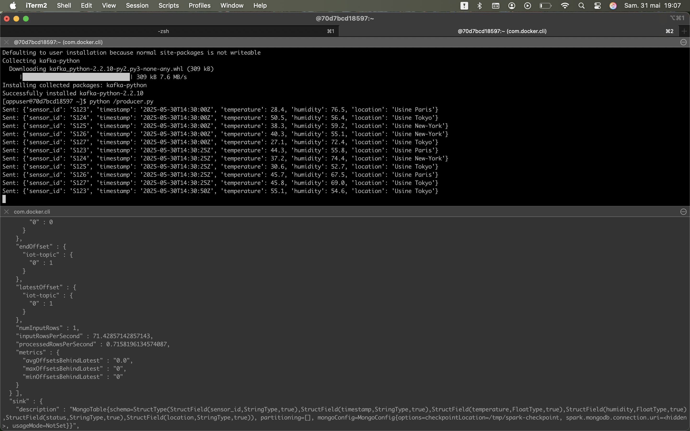

# DEVELOPPEMENT D'UN PIPELINE DATA AVEC SPARK+KAFKA+MONGODB SUR UN ENVIRONEMENT DOCKER



## 1. Liste de pièces-jointes
- `docker-compose.yml`
- `pipeline.py`
- `producer.py`
- répertoire `data`
- ce fichier `Readme.md`
- Le fichier `cmd` (un condensé des commandes docker)

## 2. Guide d'installation

1. Démarrer les services Docker avec la commande (spécifique à MacOS) :
    ```bash
    colima start
    ```

2. Démarrer les containers Docker avec la commande :
    ```bash
    docker-compose up -d
    ```

3. Créer le topic sur le container Kafka (si ce n'est pas déjà fait) :
    - Se connecter au container :
      ```bash
      docker exec -it kafka /bin/bash
      ```
    - Créer le topic :
      ```bash
      kafka-topics --create --topic iot-topic --bootstrap-server kafka:9092 --partitions 1 --replication-factor 1
      ```

4. Copier le script du pipeline dans le container spark-master :
    - Copier le fichier :
      ```bash
      docker cp pipeline.py spark-master:/opt/bitnami/spark/
      ```
    - Connexion au container :
      ```bash
      docker exec -it spark-master /bin/bash
      ```

5. Exécuter le script avec Spark sur le container Spark :
    ```bash
    spark-submit --packages org.apache.spark:spark-sql-kafka-0-10_2.12:3.5.1,org.mongodb.spark:mongo-spark-connector_2.12:10.2.0 /opt/bitnami/spark/pipeline.py
    ```

6. Il faut créer un producteur et faire le test sur le container Kafka :
    - Créer un producteur :
      ```bash
      kafka-console-producer --topic iot-topic --bootstrap-server kafka:9092
      ```
    - Tester en envoyant un message :
      ```json
      {"sensor_id": "S123", "timestamp": "2025-05-30T14:30:00Z", "temperature": 55.0, "humidity": 65.2, "status": "normal", "location": "factory_A"}
      ```

7. Vérifier si Spark a intercepté le message et a sauvegardé les données dans MongoDB :
    - Si tout s'est bien passé, plusieurs fichiers seront créés dans le répertoire `./data` de la machine locale.
    - En cas d'erreur, consulter le log du container MongoDB avec la commande :
      ```bash
      docker logs mongodb
      ```
    - En cas de problème de droits, accorder les droits nécessaires à MongoDB avec la commande :
      ```bash
      sudo chown -R 999:999 ./data
      ```
      Il faut relancer le container par la suite.

8. Maintenant il faut automatiser le producteur et copier le fichier avec la commande :
    ```bash
    docker cp producer.py kafka:/
    ```
   - Installer la librairie kafka si ce n'est pas déjà fait :
     ```bash
     python -m pip install kafka-python
     ```
   - Et démarrer le script avec :
     ```bash
     python /producer.py
     ```